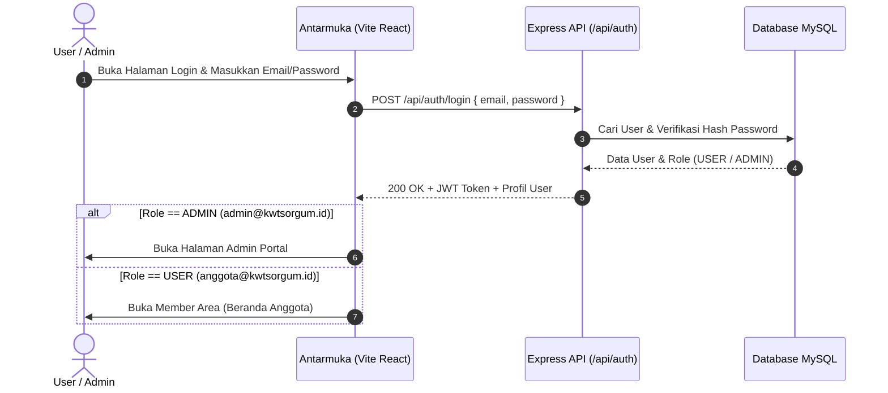
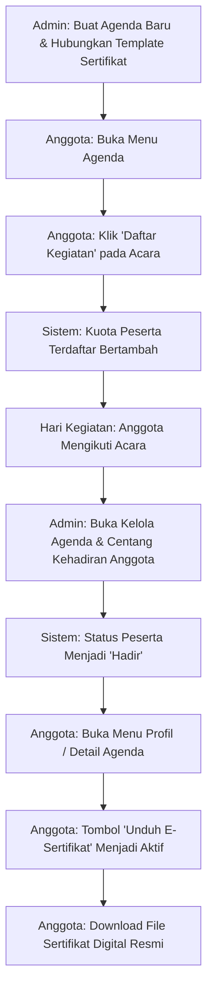
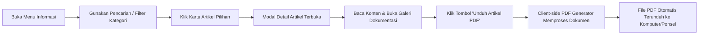
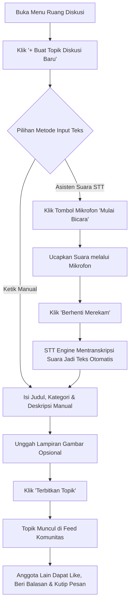
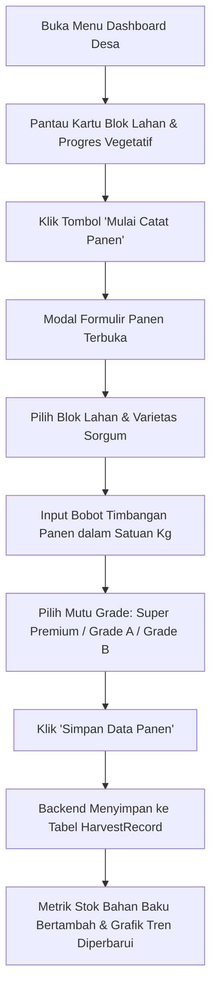
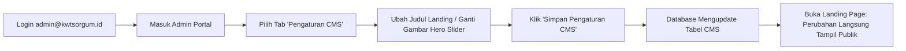

# 🌾 Alur dan Fitur Utama — Community App Bestari (KWT Sorgum)

Dokumen ini memuat panduan lengkap mengenai **Daftar Fitur Utama**, **Kredensial Akun Pengujian**, dan **Alur Kerja (Workflow Flowchart & Step-by-Step)** pada aplikasi **Community App Bestari**.

---

## 🔑 1. Kredensial Akun Pengujian (Testing Accounts)

Untuk melakukan pengujian sistem secara menyeluruh, gunakan akun yang telah dikonfigurasi pada database:

| Peran (Role) | Alamat Email | Kata Sandi (Password) | Nama Akun | Deskripsi Akses |
|---|---|---|---|---|
| **Anggota (User)** | `anggota@kwtsorgum.id` | `sorgum123` | **Ibu Hj. Kartini** | Hak akses member komunitas: Beranda, Artikel & Download PDF, Pendaftaran Agenda & E-Sertifikat, Forum Diskusi (STT), Dashboard SCM Lahan & Catat Panen, Pengaturan Profil. |
| **Admin Pengelola** | `admin@kwtsorgum.id` | `admin123` | **Alya Permata** | Hak akses penuh Admin Portal: Dashboard Statistik, Kelola Informasi (Quill Editor), Kelola Pengumuman, Kelola Agenda & Presensi Kehadiran, Certificate Builder, Moderasi Forum, SCM Lahan/Panen, CMS & Banner, Kelola Pengguna. |

### 🚀 Cara Menjalankan Aplikasi
```bash
# Jalankan dari direktori utama project
cd "D:\Project Bestari"
npm run dev
```
- **Frontend App**: `http://localhost:5173`
- **Backend API**: `http://localhost:8000`
- **API Health Check**: `http://localhost:8000/api/health`

---

## 📋 2. Daftar Lengkap Fitur Utama Aplikasi

### A. Akses Publik & Autentikasi
1. **Landing Page Dinamis**:
   - Hero slider interaktif dengan navigasi banner otomatis/manual.
   - Seksi pengenalan Komunitas Wanita Tani (KWT) Sorgum & nilai gizi sorgum.
   - Cuplikan artikel edukasi terbaru, agenda kegiatan terdekat, dan ringkasan harga pasar.
   - Pilihan akses cepat ke mode masuk (Login) dan registrasi anggota baru.
2. **Autentikasi Multi-Role**:
   - Form registrasi anggota baru dengan validasi data dan enkripsi kata sandi (*Bcrypt*).
   - Login terintegrasi dengan deteksi role otomatis (*Anggota dialihkan ke Member Area, Admin dialihkan ke Admin Portal*).
   - Fitur *Remember Me* untuk menyimpan sesi pengguna secara aman.
3. **Dual Mode Tampilan (Mode Pro & Mode Lite)**:
   - **Mode Pro**: Desain visual penuh, kaya animasi, kartu interaktif, dan grafis modern.
   - **Mode Lite**: Desain sederhana, ringan, efisien kuota data, dan ramah untuk penggunaan di perangkat ponsel lapangan.

---

### B. Fitur Anggota / User (`anggota@kwtsorgum.id`)

1. **Beranda (Home Dashboard)**:
   - Banner sambutan dinamis berdasar identitas anggota yang login.
   - Widget agenda terdekat yang diikuti dan pengumuman komunitas terbaru.
   - Ringkasan statistik aktivitas anggota dan artikel sorotan.
   - Lonceng notifikasi sistem (termasuk *Pengingat H-1 Kegiatan*).
2. **Informasi & Artikel Edukasi Sorgum**:
   - Katalog artikel informatif (kategori: *Budidaya*, *Inovasi*, *Pengetahuan*, *Panen*).
   - Kolom pencarian instan dan penyaringan berdasarkan kategori.
   - Modal detail artikel dengan galeri dokumentasi foto.
   - **Fitur Unduh Artikel ke PDF**: Konversi langsung artikel ke dokumen PDF rapi berkop resmi KWT Sorgum lengkap dengan tanggal rilis dan nama penulis.
3. **Agenda Kegiatan & E-Sertifikat**:
   - Kalender dan daftar agenda pelatihan, pertemuan, dan panen raya.
   - Pendaftaran kegiatan mandiri (*Daftar / Batal Daftar*) dengan pembaruan sisa kuota *real-time*.
   - Rundown waktu kegiatan, lokasi acara, dan kontak narahubung (*Contact Person*).
   - Tautan unduh materi pelatihan dan galeri dokumentasi kegiatan.
   - **Klaim & Unduh E-Sertifikat Digital**: Otomatis aktif dan dapat diunduh anggota yang telah terdaftar dan ditandai hadir oleh admin.
4. **Ruang Diskusi Komunitas (Forum)**:
   - Feed diskusi multi-topik (*Produksi & Pengolahan*, *Budidaya Lahan*, *Pemasaran & UMKM*, *Informasi Umum*).
   - Pembuatan topik diskusi baru dengan unggahan lampiran gambar.
   - Komentar berbalas (*threaded comments*) dan fitur kutip pesan (*quote reply*).
   - Tombol suka (*Like*) pada topik dan komentar.
   - **Asisten Suara Pintar (Voice-to-Text / STT)**: Memungkinkan anggota merekam suara langsung melalui mikrofon untuk dikonversi menjadi teks input.
5. **Dashboard Desa & Rantai Pasok (SCM Lahan & Panen)**:
   - Pemantauan visual blok lahan sorgum (luas area, varietas bibit, fase vegetatif/generatif, estimasi tanggal panen).
   - **Pencatatan Panen Mandiri ("Mulai Catat Panen")**: Formulir input tanggal panen, blok lahan, varietas tanaman, bobot timbangan (kg), grade kualitas (*Super Premium*, *Grade A*, *Grade B*), dan catatan lapangan.
   - Grafik tren panen bulanan dan total ketersediaan persediaan bahan baku (*Raw Material*).
   - Tabel harga pasar komoditas sorgum terkini (*Tepung Premium, Biji Kupas, Biji Pakan, Sirup Sorgum*) dengan indikator tren naik/turun.
   - Tombol sinkronisasi data SCM langsung ke server LivingLabs.
6. **Profil Anggota & Pengaturan Akun**:
   - Informasi biodata lengkap anggota (telepon, alamat, lokasi lahan, varietas budidaya).
   - Fitur kustomisasi **Nama Lengkap untuk Sertifikat** (memungkinkan penulisan gelar formal).
   - Riwayat seluruh perolehan E-Sertifikat yang pernah didapatkan beserta tombol unduh langsung.
   - Pengaturan keamanan akun (ganti password).

---

### C. Fitur Admin Portal (`admin@kwtsorgum.id`)

1. **Dashboard Analitik Admin**:
   - Metrik ringkasan: Total Anggota Terdaftar, Total Artikel Edukasi, Agenda Aktif, Total Hasil Panen (Kg).
   - Grafik visualisasi aktivitas pengguna dan tren panen tahunan.
2. **Kelola Informasi & Artikel**:
   - Pembuatan dan pengeditan artikel menggunakan **React Quill Rich Text Editor** (format teks tebal, miring, list, perataan, warna, dan font khusus).
   - Pengunggahan gambar sampul utama dan multi-gambar untuk galeri kegiatan.
   - Fitur hapus artikel dan peninjauan pratinjau (*preview*).
3. **Kelola Pengumuman**:
   - Publikasi pengumuman berkategori (*Penting*, *Hasil Panen*, *Informasi Anggota*, *Mendesak*).
   - Pengaturan penanda status urgensi dan tanggal acara terkait.
4. **Kelola Agenda & Presensi Kehadiran Peserta**:
   - Penjadwalan agenda baru (judul, waktu, tempat, kategori, kuota maksimal, kontak panitia).
   - Penyusunan rundown acara jam demi jam.
   - Unggah materi paparan (PDF/link) dan foto dokumentasi kegiatan.
   - **Sistem Presensi / Absensi**: Admin menandai centang kehadiran anggota yang terdaftar pada kegiatan.
5. **Pembuat Sertifikat Digital (Certificate Builder)**:
   - Desain template sertifikat kustom (pilihan palet warna: *Emerald Forest*, *Gold Luxury*, *Classic Ivory*, *Modern Blue*).
   - Penyesuaian nomor SK / nomor sertifikat, judul penghargaan, dan teks sambutan.
   - Pembubuhan tanda tangan digital pengurus (Ketua KWT, Pembina Desa) dan stempel stempel resmi.
   - *Live Interactive Preview* sertifikat.
   - Penautan template sertifikat ke agenda kegiatan spesifik.
6. **Moderasi Diskusi Komunitas**:
   - Pengawasan seluruh topik dan percakapan forum.
   - Fitur sematkan topik penting (*Pin Topic*) agar selalu berada di posisi paling atas.
   - Fitur hapus topik atau komentar yang melanggar aturan/spam.
7. **Kelola Data Sorgum (SCM Management)**:
   - Manajemen blok lahan budidaya anggota.
   - Verifikasi dan peninjauan riwayat pencatatan hasil panen yang diinput oleh petani.
8. **Pengaturan Tampilan CMS**:
   - Kustomisasi nama aplikasi, sub-judul, dan logo resmi.
   - Pengaturan teks *Hero Section* dan susunan gambar banner slider *Landing Page*.
   - Pengaturan teks *Footer* (Kebijakan Privasi, Syarat & Ketentuan, Bantuan).
9. **Manajemen Pengguna (Users Management)**:
   - Daftar seluruh akun anggota dan pengurus yang terdaftar.
   - Pencarian pengguna, peninjauan status keaktifan akun, dan pengaturan hak akses peran (*Role*).

---

## 🔄 3. Alur Kerja Fitur-Fitur Utama (Feature Workflows)

### Alur 1: Autentikasi & Penentuan Ruang Kerja (User vs Admin)



**Langkah Pengujian:**
1. Masuk menggunakan `anggota@kwtsorgum.id` / `sorgum123` ➔ Masuk ke **Beranda Anggota**.
2. Logout, kemudian masuk menggunakan `admin@kwtsorgum.id` / `admin123` ➔ Masuk ke **Admin Portal**.

---

### Alur 2: Siklus Pendaftaran Agenda ➔ Presensi ➔ Terbit E-Sertifikat



**Langkah Pengujian:**
1. **Langkah Anggota**:
   - Login sebagai `anggota@kwtsorgum.id`.
   - Buka menu **Agenda**.
   - Cari kegiatan yang belum dimulai, klik tombol **Daftar Sekarang**.
   - Periksa bahwa tombol berubah menjadi *"Batal Daftar"* dan status peserta *"Terdaftar"*.
2. **Langkah Admin**:
   - Login sebagai `admin@kwtsorgum.id`.
   - Buka **Admin Portal** ➔ Tab **Kelola Agenda**.
   - Buka daftar peserta pada kegiatan tersebut, centang kehadiran untuk *"Ibu Hj. Kartini"*.
3. **Langkah Verifikasi Sertifikat**:
   - Kembali ke akun `anggota@kwtsorgum.id`.
   - Buka menu **Profil** ➔ Bagian **Riwayat Sertifikat**.
   - Sertifikat atas nama **Ibu Hj. Kartini** telah terbit dan klik **Unduh Sertifikat**.

---

### Alur 3: Eksplorasi Informasi & Download Artikel Edukasi PDF



**Langkah Pengujian:**
1. Login sebagai `anggota@kwtsorgum.id`.
2. Masuk ke menu **Informasi**.
3. Ketik kata kunci pada kotak pencarian (misal: *"Panen"*), pilih kategori *"Budidaya"*.
4. Klik salah satu artikel untuk membuka jendela modal.
5. Klik tombol berikon printer/unduh bertuliskan **Unduh Artikel (PDF)** di kanan atas modal.
6. Periksa file PDF yang terunduh, pastikan tata letak rapi, judul tercetak jelas, dan berisikan konten artikel.

---

### Alur 4: Diskusi Komunitas & Penggunaan Asisten Suara (STT)



**Langkah Pengujian:**
1. Buka menu **Ruang Diskusi**.
2. Klik **+ Buat Topik Diskusi**.
3. Klik tombol Asisten Suara / Mikrofon untuk menguji perekaman audio menjadi teks.
4. Publikasikan topik dan lakukan tes kirim balasan komentar (*reply*) serta kutipan balasan (*quote*).

---

### Alur 5: Monitoring Lahan & Pencatatan Panen Mandiri (SCM)



**Langkah Pengujian:**
1. Masuk ke menu **Dashboard Desa** sebagai `anggota@kwtsorgum.id`.
2. Tinjau data lahan yang sedang ditanam.
3. Klik tombol **Mulai Catat Panen**.
4. Isi blok lahan, jenis varietas sorgum, bobot kilogram (misal: `450`), dan grade kualitas.
5. Klik simpan dan periksa apakah total bobot persediaan bahan baku (*Raw Material Kg*) pada metrik atas bertambah secara otomatis.

---

### Alur 6: Manajemen CMS & Branding oleh Admin



**Langkah Pengujian:**
1. Login sebagai `admin@kwtsorgum.id`.
2. Masuk ke tab **Pengaturan CMS**.
3. Perbarui teks judul banner beranda atau tautan gambar.
4. Simpan, lalu buka halaman utama landing page untuk memverifikasi perubahan konten secara *real-time*.

---

## 🎯 4. Matriks Ringkasan Validasi Fitur

| Fitur Utama | Modul Frontend | Modul Backend API | Status Fungsional |
|---|---|---|---|
| **Login / Register Multi-Role** | `LoginView.tsx`, `RegisterView.tsx` | `/api/auth` | Aktif & Terverifikasi |
| **Slider & Notifikasi Beranda** | `BerandaView.tsx`, `Header.tsx` | `/api/banner`, `/api/pengumuman` | Aktif & Terverifikasi |
| **Artikel Edukasi & Unduh PDF** | `InformasiView.tsx`, `articlePdf.ts` | `/api/artikel` | Aktif & Terverifikasi |
| **Agenda & Pendaftaran Peserta** | `AgendaView.tsx` | `/api/agenda` | Aktif & Terverifikasi |
| **E-Sertifikat Digital Otomatis** | `CertificateBuilderView.tsx`, `ProfilView.tsx` | `/api/admin/certificate` | Aktif & Terverifikasi |
| **Forum Diskusi & Komentar** | `DiskusiView.tsx`, `CreateTopicModal.tsx` | `/api/thread` | Aktif & Terverifikasi |
| **Asisten Suara Pintar (STT)** | `AgendaView.tsx`, `DiskusiView.tsx` | `/api/stt` | Aktif & Terverifikasi |
| **Dashboard Lahan & SCM Panen** | `DashboardDesaView.tsx`, `MulaiPanenModal.tsx` | `/api/dashboard`, `/api/scm` | Aktif & Terverifikasi |
| **Profil & Ubah Data Anggota** | `ProfilView.tsx` | `/api/auth/profile` | Aktif & Terverifikasi |
| **Portal Pengelolaan Admin** | `AdminPortalView.tsx` | `/api/admin/*`, `/api/cms` | Aktif & Terverifikasi |
| **Mode Tampilan Hemat (Lite Mode)**| `*ViewLite.tsx` | Sisi Klien / Penyimpanan Sesi | Aktif & Terverifikasi |
