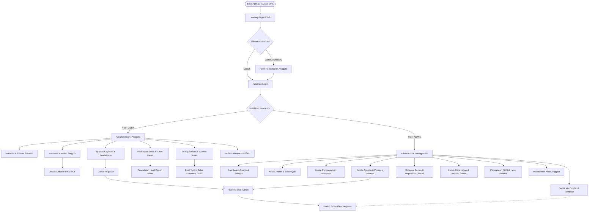

# 📋 DOKUMEN PENGUJIAN FITUR UTAMA & ALUR KERJA (TESTING & WORKFLOW FLOW)
## Sistem Informasi Komunitas Wanita Tani Sorgum — Community App Bestari

---

## 📌 1. Informasi Umum & Lingkungan Pengujian

Dokumen ini memuat panduan komprehensif untuk pengujian fungsionalitas fitur utama, alur navigasi (*user journey*), dan matriks skenario pengujian (*test cases*) aplikasi **Community App Bestari (KWT Sorgum)**.

| Parameter | Keterangan |
|---|---|
| **Nama Aplikasi** | Community App Bestari (KWT Sorgum) |
| **Teknologi Backend** | Node.js, Express, Prisma ORM, MySQL, Whisper STT |
| **Teknologi Frontend** | React, TypeScript, Vite, Tailwind CSS, Lucide Icons |
| **URL Frontend** | `http://localhost:5173` |
| **URL Backend API** | `http://localhost:8000` |
| **Health Check API** | `http://localhost:8000/api/health` |
| **Tanggal Rilis Dokumen** | 2026 |

---

## 🔑 2. Kredensial Akun Pengujian

Pengujian sistem dibagi ke dalam dua peran (*roles*) utama dengan tingkat akses dan hak istimewa yang berbeda:

| Peran (Role) | Email Login | Kata Sandi (Password) | Nama Akun | Hak Akses Utama |
|---|---|---|---|---|
| **Anggota (User)** *(Wajib Pengujian)* | `anggota@kwtsorgum.id` | `sorgum123` | **Ibu Hj. Kartini** | Mengakses Beranda, Membaca & Download PDF Artikel, Mendaftar Agenda, Klaim E-Sertifikat, Berdiskusi di Forum Komunitas, Memantau Lahan & Catat Panen di Dashboard Desa, Kelola Profil Pribadi. |
| **Admin Pengelola** | `admin@kwtsorgum.id` | `admin123` | **Alya Permata** | Akses Penuh Admin Portal: Dashboard Analitik, Kelola Artikel/Informasi, Kelola Pengumuman, Kelola Agenda & Presensi Peserta, Certificate Builder, Moderasi Forum, Manajemen SCM Lahan & Panen, Pengaturan CMS & Banner, Kelola Data Pengguna. |

> 💡 **Petunjuk Menjalankan Aplikasi Secara Bersamaan:**
> Buka terminal pada direktori `d:\Project Bestari` lalu jalankan perintah:
> ```bash
> npm run dev
> ```
> Perintah di atas akan mengeksekusi backend pada port 8000 dan frontend pada port 5173 secara bersamaan.

---

## 🗺️ 3. Peta Alur Kerja Sistem (System Workflow Architecture)

### 3.1. Diagram Alur Utama (End-to-End User & Admin Flow)



---

## 🔄 4. Rincian Alur Flow Fitur Kunci

### Flow A: Pendaftaran Agenda hingga Pengambilan E-Sertifikat
Alur ini menguji kolaborasi antara anggota dan admin dalam siklus kegiatan komunitas:
1. **Anggota (`anggota@kwtsorgum.id`)**:
   - Masuk ke menu **Agenda Kegiatan**.
   - Memilih kegiatan berstatus *"Belum dimulai"* (misal: *Workshop Diversifikasi Olahan Pangan Sorgum*).
   - Menekan tombol **Daftar Kegiatan**. Sistem memperbarui kuota dan status menjadi *"Terdaftar"*.
2. **Admin (`admin@kwtsorgum.id`)**:
   - Masuk ke **Admin Portal** ➔ Tab **Kelola Agenda**.
   - Buka kegiatan tersebut, masuk ke daftar peserta terdaftar.
   - Tandai kehadiran anggota (**Checklist Kehadiran / Hadir**).
   - Pastikan template sertifikat telah dihubungkan melalui tab **Kelola Sertifikat**.
3. **Anggota (`anggota@kwtsorgum.id`)**:
   - Buka kembali agenda atau masuk ke menu **Profil** ➔ Bagian **Riwayat Sertifikat**.
   - Sertifikat digital resmi diterbitkan dengan nama anggota tertera.
   - Klik tombol **Unduh Sertifikat** untuk menyimpan sertifikat format gambar/dokumen.

---

### Flow B: Eksplorasi Informasi & Unduh Artikel Edukasi PDF
1. Anggota membuka menu **Informasi**.
2. Melakukan pencarian materi berdasarkan kata kunci (contoh: *"Panen"* atau *"Tepung"*) atau filter kategori (*Budidaya*, *Inovasi*, *Pengetahuan*, *Panen*).
3. Klik salah satu kartu artikel untuk membuka **Modal Detail Artikel**.
4. Di dalam modal, anggota dapat melihat galeri foto kegiatan dan membaca konten lengkap.
5. Klik tombol **Unduh Artikel (PDF)** di pojok kanan atas modal. Sistem mengeksekusi *client-side generation* (`articlePdf.ts`) dan mengunduh berkas PDF rapi siap cetak.

---

### Flow C: Diskusi Komunitas & Penggunaan Voice-to-Text (STT)
1. Anggota membuka menu **Ruang Diskusi**.
2. Menekan tombol **+ Buat Topik Diskusi Baru**.
3. Mengisi judul, memilih kategori (*Produksi & Pengolahan*, *Budidaya Lahan*, dll.), dan mengunggah lampiran foto jika diperlukan.
4. Pada input konten, gunakan opsi input teks atau aktifkan ikon mikrofon (*Asisten Suara Pintar / Speech to Text*) untuk merekam suara yang secara otomatis diubah menjadi teks catatan.
5. Publikasikan topik. Topik tampil di daftar diskusi komunitas.
6. Anggota lain atau admin dapat memberikan suka (*Like*), mengutip balasan (*Quote Reply*), serta mengirimkan komentar bertingkat (*Threaded Comments*).

---

### Flow D: Monitoring Lahan & Input Pencatatan Panen Mandiri (SCM)
1. Anggota membuka menu **Dashboard Desa**.
2. Memeriksa blok lahan yang terdaftar (Varietas sorgum, fase vegetatif/generatif, estimasi tanggal panen).
3. Klik tombol **Mulai Catat Panen**.
4. Isi formulir pencatatan panen:
   - Pilih Blok Lahan (misal: *Blok C - Rajawali*).
   - Masukkan Varietas Sorgum (misal: *Sorgum Manis Super 1*).
   - Masukkan Hasil Timbangan Bersih (Kg).
   - Pilih Grade Kualitas (*Super Premium*, *Grade A*, atau *Grade B*).
   - Berikan catatan singkat kondisi hasil bumi.
5. Klik **Simpan Data Panen**. Data tersinkronisasi langsung ke metrik total persediaan bahan baku KWT dan grafik tren panen.

---

## 🧪 5. Matriks Skenario Pengujian Fungsional (Test Cases)

### Modul 1: Autentikasi, Registrasi & Akses Sesi

| No. TC | Skenario Pengujian | Akun Uji | Langkah Pengujian | Data Uji | Hasil yang Diharapkan | Status |
|---|---|---|---|---|---|---|
| **TC-AUTH-01** | Login Anggota Berhasil | `anggota@kwtsorgum.id` | 1. Buka `http://localhost:5173`<br>2. Klik tombol **Masuk** pada Landing Page<br>3. Masukkan email & password anggota<br>4. Klik tombol **Masuk** | Email: `anggota@kwtsorgum.id`<br>Pass: `sorgum123` | Berhasil login, toast notifikasi sukses muncul, diarahkan ke halaman **Beranda Anggota**, nama *"Ibu Hj. Kartini"* muncul di profil. | `[ ] Pass`<br>`[ ] Fail` |
| **TC-AUTH-02** | Login Admin Berhasil | `admin@kwtsorgum.id` | 1. Buka halaman Login<br>2. Masukkan kredensial admin<br>3. Klik tombol **Masuk** | Email: `admin@kwtsorgum.id`<br>Pass: `admin123` | Berhasil login dan langsung diarahkan ke **Admin Portal**, semua tab manajemen admin dapat diakses. | `[ ] Pass`<br>`[ ] Fail` |
| **TC-AUTH-03** | Validasi Password Salah | Sembarang | 1. Masukkan email valid<br>2. Masukkan password salah<br>3. Klik tombol **Masuk** | Email: `anggota@kwtsorgum.id`<br>Pass: `passwordSalah999` | Tampil pesan peringatan kegagalan autentikasi (*"Kredensial tidak valid"*), sistem menolak akses masuk. | `[ ] Pass`<br>`[ ] Fail` |
| **TC-AUTH-04** | Pendaftaran Akun Baru | Pengguna Baru | 1. Klik menu **Daftar Akun**<br>2. Isi Nama Lengkap, Email unik, No. HP, Password, dan Konfirmasi Password<br>3. Klik **Daftar Sekarang** | Nama: *Siti Aminah*<br>Email: `siti@kwtsorgum.id`<br>Pass: `siti12345` | Akun baru terdaftar di database, muncul konfirmasi sukses, dialihkan ke halaman login. | `[ ] Pass`<br>`[ ] Fail` |
| **TC-AUTH-05** | Logout Akun | `anggota@kwtsorgum.id` | 1. Klik menu profil / tombol logout di navigasi<br>2. Konfirmasi logout | - | Sesi terhapus (*clear token*), pengguna dikembalikan ke **Landing Page** publik. | `[ ] Pass`<br>`[ ] Fail` |

---

### Modul 2: Beranda, Navigasi & Pengumuman

| No. TC | Skenario Pengujian | Akun Uji | Langkah Pengujian | Data Uji | Hasil yang Diharapkan | Status |
|---|---|---|---|---|---|---|
| **TC-HOME-01** | Tampilan Slider Hero & Ringkasan | `anggota@kwtsorgum.id` | 1. Akses menu **Beranda**<br>2. Amati banner slider dan kartu ringkasan kegiatan | - | Banner edukasi sorgum berganti secara otomatis/manual, ringkasan agenda mendatang tampil akurat. | `[ ] Pass`<br>`[ ] Fail` |
| **TC-HOME-02** | Modal Pengumuman Komunitas | `anggota@kwtsorgum.id` | 1. Pada Beranda, lihat daftar pengumuman penting<br>2. Klik salah satu pengumuman | Pengumuman: *Jadwal Distribusi Pupuk Organik* | Modal detail pengumuman terbuka, menampilkan judul, tanggal rilis, isi pesan lengkap, dan target anggota. | `[ ] Pass`<br>`[ ] Fail` |
| **TC-HOME-03** | Notifikasi Pengingat Kegiatan | `anggota@kwtsorgum.id` | 1. Klik ikon lonceng notifikasi di bilah atas (*header*) | - | Menampilkan daftar notifikasi (termasuk pengingat H-1 agenda jika anggota telah terdaftar di acara besok). | `[ ] Pass`<br>`[ ] Fail` |
| **TC-HOME-04** | Beralih Mode Visual (Pro vs Lite) | `anggota@kwtsorgum.id` | 1. Klik tombol saklar *Mode Pro / Mode Lite* di navigasi | - | Antarmuka berganti ke mode *Lite* (tampilan ringkas, ramah perangkat mobile dan hemat data) tanpa error. | `[ ] Pass`<br>`[ ] Fail` |

---

### Modul 3: Modul Informasi & Unduh Artikel PDF

| No. TC | Skenario Pengujian | Akun Uji | Langkah Pengujian | Data Uji | Hasil yang Diharapkan | Status |
|---|---|---|---|---|---|---|
| **TC-INFO-01** | Filter & Pencarian Artikel | `anggota@kwtsorgum.id` | 1. Masuk menu **Informasi**<br>2. Ketik kata kunci pada kotak pencarian<br>3. Klik filter kategori (misal: *Inovasi*) | Keyword: *"Tepung"*<br>Kategori: *Inovasi* | Daftar artikel tersaring secara instan sesuai kata kunci dan kategori yang dipilih. | `[ ] Pass`<br>`[ ] Fail` |
| **TC-INFO-02** | Modal Detail & Galeri Artikel | `anggota@kwtsorgum.id` | 1. Klik kartu artikel *Panen Sorgum Bersama*<br>2. Periksa galeri foto dan teks artikel | Artikel ID Terpilih | Modal detail terbuka dengan tata letak rapi, foto galeri dapat dilihat dengan jelas, deskripsi lengkap terbaca. | `[ ] Pass`<br>`[ ] Fail` |
| **TC-INFO-03** | Unduh Artikel ke Format PDF | `anggota@kwtsorgum.id` | 1. Pada modal detail artikel, klik tombol **Unduh Artikel (PDF)** | - | Browser langsung men-download berkas berkop KWT Sorgum (`.pdf`) berisi teks, tanggal, dan nama penulis artikel. | `[ ] Pass`<br>`[ ] Fail` |

---

### Modul 4: Agenda Kegiatan & E-Sertifikat

| No. TC | Skenario Pengujian | Akun Uji | Langkah Pengujian | Data Uji | Hasil yang Diharapkan | Status |
|---|---|---|---|---|---|---|
| **TC-AGEN-01** | Pendaftaran Kegiatan Komunitas | `anggota@kwtsorgum.id` | 1. Masuk menu **Agenda**<br>2. Pilih kegiatan berstatus *Belum dimulai*<br>3. Klik tombol **Daftar Sekarang** | Event: *Pelatihan Pasca Panen Sorgum* | Status berubah menjadi *"Terdaftar"*, kuota peserta bertambah 1, tombol berubah menjadi *"Batal Daftar"*. | `[ ] Pass`<br>`[ ] Fail` |
| **TC-AGEN-02** | Pembatalan Pendaftaran Kegiatan | `anggota@kwtsorgum.id` | 1. Pada kegiatan yang sudah diikuti, klik tombol **Batal Daftar**<br>2. Konfirmasi pembatalan | - | Status kepesertaan dibatalkan, kuota berkurang 1, status tombol kembali menjadi *"Daftar Sekarang"*. | `[ ] Pass`<br>`[ ] Fail` |
| **TC-AGEN-03** | Unduh Materi & Dokumentasi | `anggota@kwtsorgum.id` | 1. Buka agenda yang memiliki materi lampiran<br>2. Klik tombol unduh materi/tautan | - | Berkas panduan pelatihan atau tautan dokumentasi terbuka dengan valid. | `[ ] Pass`<br>`[ ] Fail` |
| **TC-AGEN-04** | Klaim & Unduh E-Sertifikat | `anggota@kwtsorgum.id` | 1. Buka agenda selesai di mana anggota telah ditandai hadir oleh admin<br>2. Klik **Lihat / Unduh E-Sertifikat** | Template ID terkait | Tampil sertifikat resmi berisikan nama anggota (*"Ibu Hj. Kartini"*), nomor sertifikat, dan tombol unduh berfungsi. | `[ ] Pass`<br>`[ ] Fail` |

---

### Modul 5: Ruang Diskusi Komunitas & Voice-to-Text

| No. TC | Skenario Pengujian | Akun Uji | Langkah Pengujian | Data Uji | Hasil yang Diharapkan | Status |
|---|---|---|---|---|---|---|
| **TC-FORUM-01** | Pembuatan Topik Diskusi Baru | `anggota@kwtsorgum.id` | 1. Masuk menu **Ruang Diskusi**<br>2. Klik **+ Buat Topik Diskusi**<br>3. Masukkan judul, kategori, dan deskripsi<br>4. Klik **Terbitkan Topik** | Judul: *Tips Menjaga Mutu Biji Kering*<br>Kategori: *Produksi & Pengolahan* | Topik baru segera terbit dan berada di urutan teratas feed diskusi komunitas. | `[ ] Pass`<br>`[ ] Fail` |
| **TC-FORUM-02** | Asisten Suara Pintar (Voice Input) | `anggota@kwtsorgum.id` | 1. Pada formulir/agenda input yang memiliki fitur suara, klik tombol **Mulai Bicara Sekarang** (Asisten Suara)<br>2. Berbicara melalui mikrofon<br>3. Klik **Berhenti Merekam** | Suara: *"Pengeringan gabah sorgum"* | Suara diproses oleh modul STT dan hasil transkripsi teks langsung mengisi bidang teks. | `[ ] Pass`<br>`[ ] Fail` |
| **TC-FORUM-03** | Kirim Komentar & Kutip Pesan | `anggota@kwtsorgum.id` | 1. Buka salah satu diskusi<br>2. Klik tombol **Kutip Balasan** pada komentar anggota lain<br>3. Tuliskan pesan balasan<br>4. Kirim komentar | Pesan: *Terima kasih atas tipsnya, sangat bermanfaat!* | Pesan terkirim sebagai komentar bersarang (*nested reply*) dengan kutipan pesan sebelumnya terlampir. | `[ ] Pass`<br>`[ ] Fail` |
| **TC-FORUM-04** | Memberikan Suka (Like) | `anggota@kwtsorgum.id` | 1. Klik ikon hati / jempol pada topik diskusi atau komentar | - | Jumlah suka bertambah 1, warna tombol menyala aktif. Klik kembali untuk membatalkan suka (*unlike*). | `[ ] Pass`<br>`[ ] Fail` |

---

### Modul 6: Dashboard Desa & Pencatatan Panen (SCM)

| No. TC | Skenario Pengujian | Akun Uji | Langkah Pengujian | Data Uji | Hasil yang Diharapkan | Status |
|---|---|---|---|---|---|---|
| **TC-SCM-01** | Monitoring Status Blok Lahan | `anggota@kwtsorgum.id` | 1. Buka menu **Dashboard Desa**<br>2. Periksa kartu status lahan | Blok: *Blok A, B, C* | Kartu lahan menampilkan persentase fase vegetatif/generatif, varietas sorgum, dan estimasi panen. | `[ ] Pass`<br>`[ ] Fail` |
| **TC-SCM-02** | Pencatatan Hasil Panen Mandiri | `anggota@kwtsorgum.id` | 1. Klik tombol **Mulai Catat Panen**<br>2. Isi blok lahan, jenis sorgum, bobot kg, mutu grade, dan catatan<br>3. Klik **Simpan Data Panen** | Blok: *Blok B - Kenari*<br>Berat: *350 Kg*<br>Grade: *Super Premium* | Riwayat panen baru berhasil tercatat, total stok bertambah, dan grafik tren ter-update. | `[ ] Pass`<br>`[ ] Fail` |
| **TC-SCM-03** | Sinkronisasi Data SCM Realtime | `anggota@kwtsorgum.id` | 1. Klik tombol **Sinkronkan Data SCM** | - | Muncul toast *"Data SCM berhasil disinkronkan"*, metrik terbaharui secara langsung dari sistem. | `[ ] Pass`<br>`[ ] Fail` |
| **TC-SCM-04** | Tinjauan Harga Pasar Komoditas | `anggota@kwtsorgum.id` | 1. Scroll ke tabel **Harga Pasar Sorgum Terkini** | - | Menampilkan daftar komoditas (Tepung Sorgum, Biji Kupas, Sirup Gula) beserta nominal harga dan indikator tren naik/turun. | `[ ] Pass`<br>`[ ] Fail` |

---

### Modul 7: Profil Anggota & Pengaturan Akun

| No. TC | Skenario Pengujian | Akun Uji | Langkah Pengujian | Data Uji | Hasil yang Diharapkan | Status |
|---|---|---|---|---|---|---|
| **TC-PROF-01** | Pembaruan Biodata Profil | `anggota@kwtsorgum.id` | 1. Buka menu **Profil**<br>2. Ubah data No. Telepon dan Varietas Sorgum<br>3. Klik **Simpan Perubahan** | Telp: `0812-7890-4321`<br>Varietas: *Bioguma 3* | Profil tersimpan sukses, data baru tampil pada kartu ringkasan identitas anggota. | `[ ] Pass`<br>`[ ] Fail` |
| **TC-PROF-02** | Pengaturan Nama Sertifikat | `anggota@kwtsorgum.id` | 1. Pada pengaturan profil, isi bidang **Nama Lengkap untuk Sertifikat** (dengan gelar)<br>2. Simpan | Nama: *Hj. Kartini Suharto, S.P.* | Nama pada E-Sertifikat yang diunduh secara otomatis menyesuaikan nama khusus sertifikat ini. | `[ ] Pass`<br>`[ ] Fail` |
| **TC-PROF-03** | Ubah Kata Sandi Akun | `anggota@kwtsorgum.id` | 1. Masuk ke tab Keamanan / Ubah Password<br>2. Masukkan password lama dan password baru<br>3. Simpan | Lama: `sorgum123`<br>Baru: `sorgum2026Baru` | Password berhasil diperbarui, pengguna dapat login kembali menggunakan password baru tersebut. | `[ ] Pass`<br>`[ ] Fail` |

---

### Modul 8: Admin Portal — Manajemen Konten & Operasional

| No. TC | Skenario Pengujian | Akun Uji | Langkah Pengujian | Data Uji | Hasil yang Diharapkan | Status |
|---|---|---|---|---|---|---|
| **TC-ADM-01** | Pembuatan Artikel Baru (Rich Editor) | `admin@kwtsorgum.id` | 1. Buka Admin Portal ➔ Tab **Kelola Informasi**<br>2. Klik **+ Tambah Artikel Baru**<br>3. Input judul, kategori, upload banner cover, dan format konten teks di React Quill<br>4. Simpan Artikel | Judul: *Teknik Pemupukan Organik Sorgum Modern* | Artikel baru berhasil tersimpan ke database dan langsung tampil di menu Informasi publik. | `[ ] Pass`<br>`[ ] Fail` |
| **TC-ADM-02** | Pengelolaan Presensi Peserta Agenda | `admin@kwtsorgum.id` | 1. Buka Admin Portal ➔ Tab **Kelola Agenda**<br>2. Buka daftar pendaftar kegiatan<br>3. Centang kehadiran anggota *Ibu Hj. Kartini* | Peserta: *Ibu Hj. Kartini* | Status kehadiran berubah menjadi *Hadir*, memicu penerbitan e-sertifikat untuk akun yang bersangkutan. | `[ ] Pass`<br>`[ ] Fail` |
| **TC-ADM-03** | Desain Template Certificate Builder | `admin@kwtsorgum.id` | 1. Buka Admin Portal ➔ Tab **Kelola Sertifikat**<br>2. Sesuaikan tema bingkai, tanda tangan pengurus, nomor SK<br>3. Tinjau *Live Preview*<br>4. Simpan Template | Tema: *Emerald Forest Gold* | Template tersimpan dan dapat dikaitkan dengan agenda pelatihan komunitas. | `[ ] Pass`<br>`[ ] Fail` |
| **TC-ADM-04** | Moderasi Forum Komunitas | `admin@kwtsorgum.id` | 1. Buka Admin Portal ➔ Tab **Moderasi Diskusi**<br>2. Pilih topik yang melanggar aturan / spam<br>3. Klik tombol **Hapus Topik** / **Sematkan Topik (Pin)** | Topik uji coba spam | Topik spam terhapus dari forum secara bersih, atau topik penting berada di posisi tersemat (*pinned*). | `[ ] Pass`<br>`[ ] Fail` |
| **TC-ADM-05** | Pengaturan CMS & Hero Banner | `admin@kwtsorgum.id` | 1. Buka Admin Portal ➔ Tab **Pengaturan CMS**<br>2. Ubah Teks Judul Utama Landing Page / Ganti URL gambar banner hero<br>3. Klik **Simpan Pengaturan CMS** | Judul Baru: *Pemberdayaan Wanita Tani Sorgum Mandiri* | Perubahan judul dan banner langsung tertera pada halaman depan (Landing Page). | `[ ] Pass`<br>`[ ] Fail` |
| **TC-ADM-06** | Manajemen Pengguna & Hak Akses | `admin@kwtsorgum.id` | 1. Buka Admin Portal ➔ Tab **Kelola Pengguna**<br>2. Periksa daftar akun terdaftar<br>3. Coba ubah status keaktifan atau cari user | Search: *"anggota@kwtsorgum.id"* | Data akun anggota ditemukan lengkap dengan status role `USER` dan data nomor telepon. | `[ ] Pass`<br>`[ ] Fail` |

---

## 📝 6. Lembar Kerja Catatan Temuan Masalah (Bug Report Sheet)

Apabila ditemukan kendala teknis atau ketidaksesuaian antarmuka selama sesi pengujian, catat temuan pada format berikut:

| ID Bug | No. Test Case | Deskripsi Masalah / Error | Tangkapan Layar / Respons API | Tingkat Urgensi (Low / Med / High) | Status Penyelesaian |
|---|---|---|---|---|---|
| *BUG-01* | *TC-INFO-03* | *Contoh: File PDF tidak otomatis terunduh di browser Safari* | *Console: Blob download blocked* | *Medium* | *[ ] Open / [x] Resolved* |
| *BUG-02* | *TC-SCM-02* | *Contoh: Bobot panen desimal belum dibulatkan* | *Payload: weightKg: 12.4555* | *Low* | *[ ] Open / [x] Resolved* |
| | | | | | |

---

## ✅ 7. Kesimpulan & Verifikasi Akhir

Setelah seluruh skenario pengujian di atas dijalankan:
- **Fitur Pengguna (Anggota)** dinyatakan lulus jika alur pendaftaran, pembacaan materi, interaksi forum, absensi/sertifikat, dan pencatatan panen berjalan mulus tanpa adanya galat *JavaScript runtime* atau kegagalan API 500.
- **Fitur Administrator** dinyatakan lulus jika pengelolaan konten (artikel, agenda, sertifikat, dan CMS) tersimpan secara persisten ke database MySQL dan langsung tercermin pada halaman antarmuka publik anggota.
